---
## Front matter
title: "ОТЧЕТ ПО ЛАБОРАТОРНОЙ РАБОТЕ № 3"
subtitle: "git"
author: "Оганнисян Давит Багратович"

## Generic otions
lang: ru-RU
toc-title: "Содержание"

## Bibliography
bibliography: bib/cite.bib
csl: pandoc/csl/gost-r-7-0-5-2008-numeric.csl

## Pdf output format
toc: true # Table of contents
toc-depth: 2
lof: true # List of figures
lot: true # List of tables
fontsize: 12pt
linestretch: 1.5
papersize: a4
documentclass: scrreprt
## I18n polyglossia
polyglossia-lang:
  name: russian
  options:
	- spelling=modern
	- babelshorthands=true
polyglossia-otherlangs:
  name: english
## I18n babel
babel-lang: russian
babel-otherlangs: english
## Fonts
mainfont: PT Serif
romanfont: PT Serif
sansfont: PT Sans
monofont: PT Mono
mainfontoptions: Ligatures=TeX
romanfontoptions: Ligatures=TeX
sansfontoptions: Ligatures=TeX,Scale=MatchLowercase
monofontoptions: Scale=MatchLowercase,Scale=0.9
## Biblatex
biblatex: true
biblio-style: "gost-numeric"
biblatexoptions:
  - parentracker=true
  - backend=biber
  - hyperref=auto
  - language=auto
  - autolang=other*
  - citestyle=gost-numeric
## Pandoc-crossref LaTeX customization
figureTitle: "Рис."
tableTitle: "Таблица"
listingTitle: "Листинг"
lofTitle: "Список иллюстраций"
lotTitle: "Список таблиц"
lolTitle: "Листинги"
## Misc options
indent: true
header-includes:
  - \usepackage{indentfirst}
  - \usepackage{float} # keep figures where there are in the text
  - \floatplacement{figure}{H} # keep figures where there are in the text
---

# Цель работы

Целью работы является изучить идеологию и применение средств контроля
версий. Приобрести практические навыки по работе с системой git.

# Задание

1. Базовая настройка git
2. Создание SSH ключа
3. Создание рабочего пространства и репозитория курса на
основе шаблона
4. Создание репозитория курса на основе шаблона
5. Настройка каталога курса
6. Задание для самостоятельной работы

# Теоретическое введение

Системы контроля версий (Version Control System, VCS) применяются при
работе нескольких человек над одним проектом. Обычно основное дерево про-
екта хранится в локальном или удалённом репозитории, к которому настроен
доступ для участников проекта. При внесении изменений в содержание проекта
система контроля версий позволяет их фиксировать, совмещать изменения,
произведённые разными участниками проекта, производить откат к любой
более ранней версии проекта, если это требуется.
В классических системах контроля версий используется централизованная
модель, предполагающая наличие единого репозитория для хранения файлов.
Выполнение большинства функций по управлению версиями осуществляется
специальным сервером. Участник проекта (пользователь) перед началом работы
посредством определённых команд получает нужную ему версию файлов. После
внесения изменений, пользователь размещает новую версию в хранилище. При
этом предыдущие версии не удаляются из центрального хранилища и к ним
можно вернуться в любой момент. Сервер может сохранять не полную версию
изменённых файлов, а производить так называемую дельта-компрессию — со-
хранять только изменения между последовательными версиями, что позволяет
уменьшить объём хранимых данных.
Системы контроля версий поддерживают возможность отслеживания и разре-
шения конфликтов, которые могут возникнуть при работе нескольких человек
над одним файлом. Можно объединить (слить) изменения, сделанные разными
участниками (автоматически или вручную), вручную выбрать нужную версию,
отменить изменения вовсе или заблокировать файлы для изменения. В зависи-
мости от настроек блокировка не позволяет другим пользователям получить
рабочую копию или препятствует изменению рабочей копии файла средствами
файловой системы ОС, обеспечивая таким образом, привилегированный доступ
только одному пользователю, работающему с файлом.
Системы контроля версий также могут обеспечивать дополнительные, более
гибкие функциональные возможности. Например, они могут поддерживать
работу с несколькими версиями одного файла, сохраняя общую историю изме-
нений до точки ветвления версий и собственные истории изменений каждой
ветви. Кроме того, обычно доступна информация о том, кто из участников, ко-
гда и какие изменения вносил. Обычно такого рода информация хранится в
журнале изменений, доступ к которому можно ограничить.
В отличие от классических, в распределённых системах контроля версий цен-
тральный репозиторий не является обязательным.
Среди классических VCS наиболее известны CVS, Subversion, а среди распре-
делённых — Git, Bazaar, Mercurial. Принципы их работы схожи, отличаются они
в основном синтаксисом используемых в работе команд.

# Выполнение лабораторной работы

## Базовая настройка git

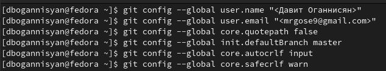{ #fig:001 width=70% }

## Создание SSH ключа

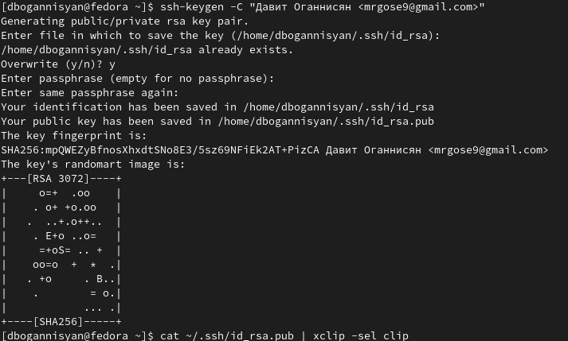{ #fig:002 width=70% }

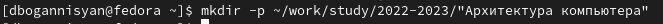{ #fig:003 width=70% }

## Создание рабочего пространства и репозитория курса на основе шаблона

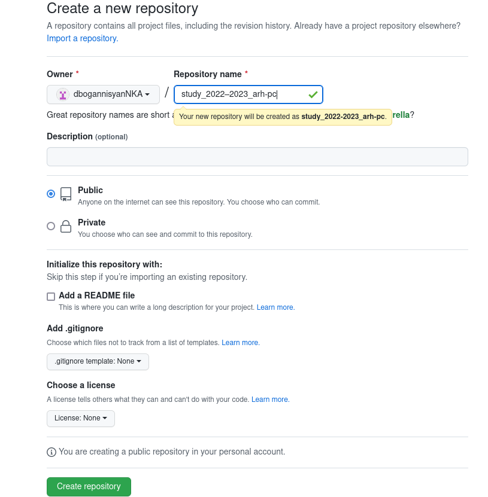{ #fig:004 width=70% }

## Создание репозитория курса на основе шаблона

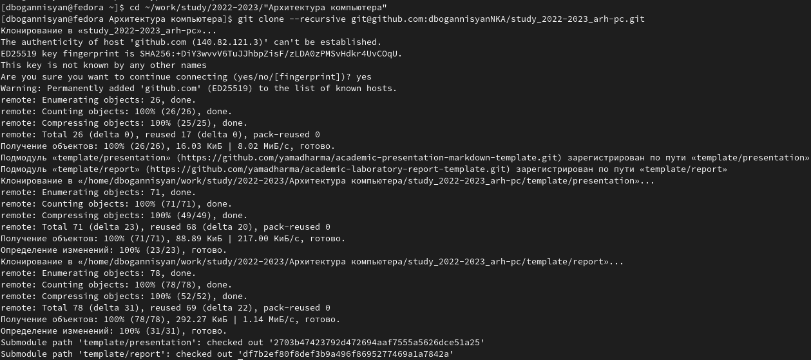{ #fig:005 width=70% }

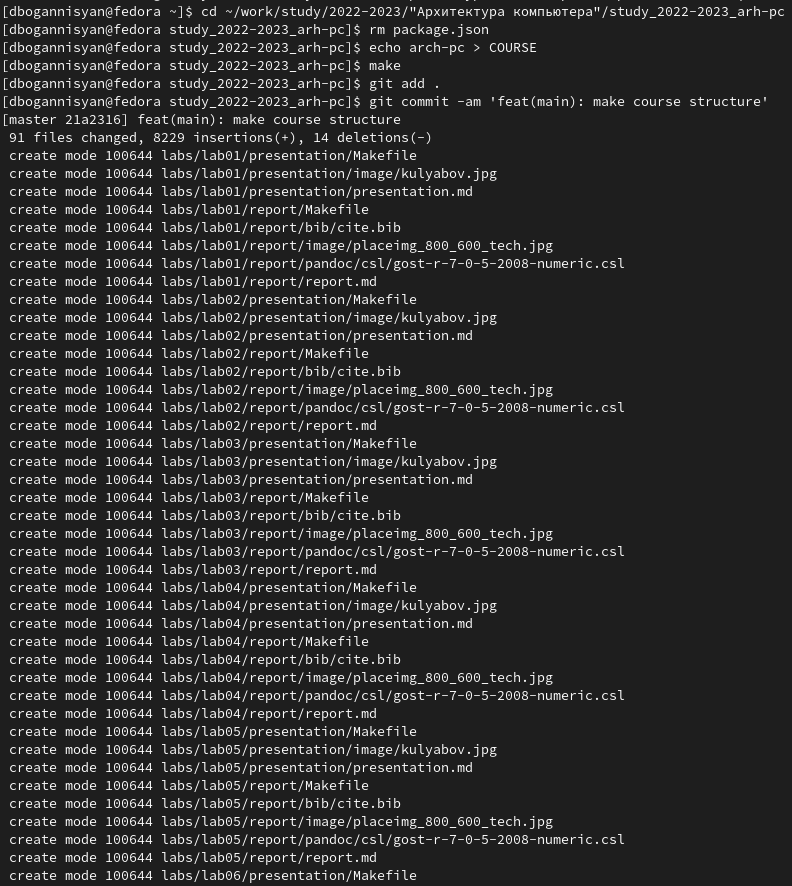{ #fig:006 width=70% }

## Настройка каталога курса

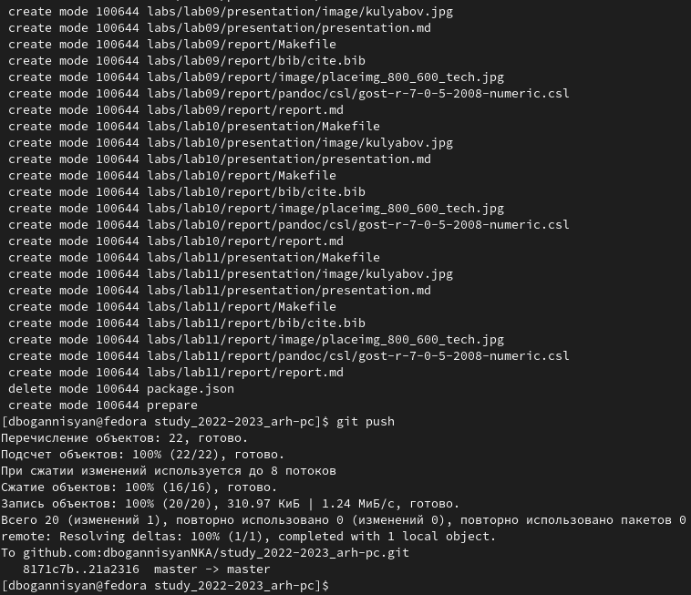{ #fig:007 width=70% }

## Задание для самостоятельной работы

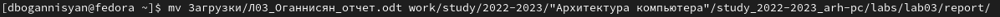{ #fig:008 width=70% }

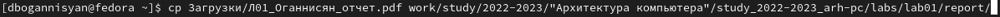{ #fig:009 width=70% }

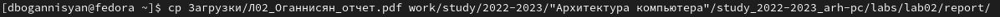{ #fig:010 width=70% }

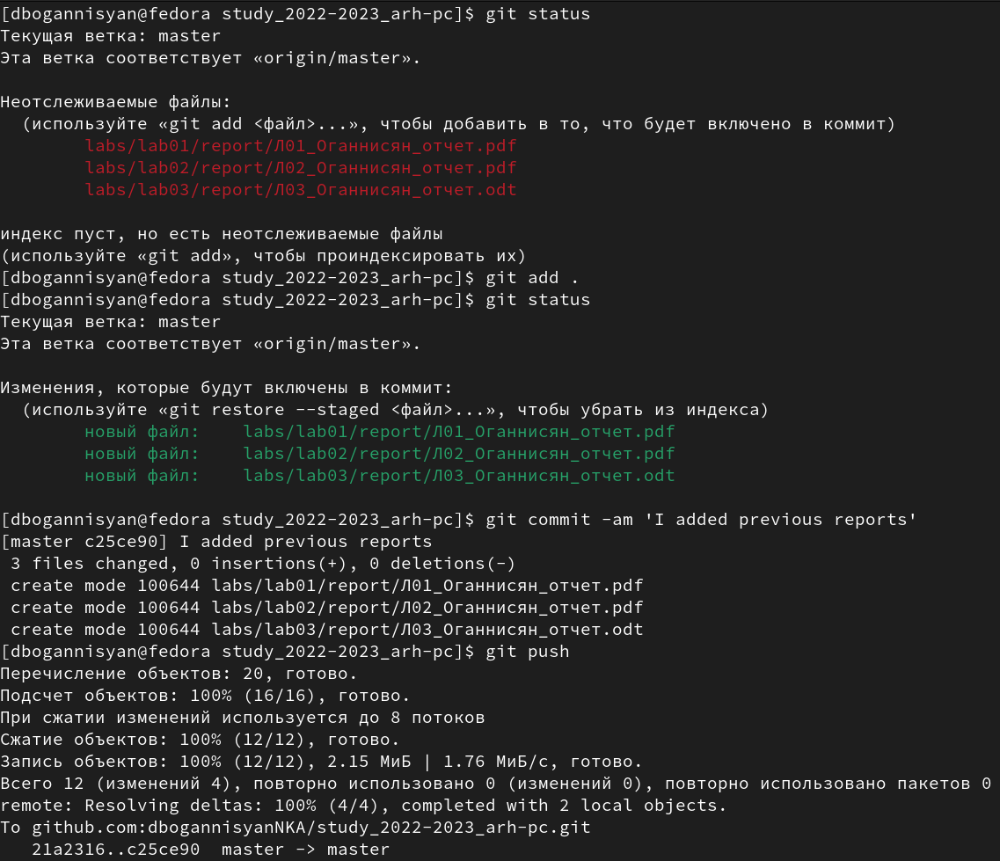{ #fig:011 width=70% }

# Выводы

Я изучил идеологию и применение средств
контроля
версий, приобрел практические навыки по
работе с системой git.

