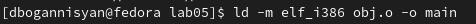

---
## Front matter
title: "Отчёт по лабораторной работе № 5"
subtitle: "Создание и процесс обработки программ на языке ассемблера NASM"
author: "Давит Оганнисян Багратович"

## Generic otions
lang: ru-RU
toc-title: "Содержание"

## Bibliography
bibliography: bib/cite.bib
csl: pandoc/csl/gost-r-7-0-5-2008-numeric.csl

## Pdf output format
toc: true # Table of contents
toc-depth: 2
lof: true # List of figures
lot: true # List of tables
fontsize: 12pt
linestretch: 1.5
papersize: a4
documentclass: scrreprt
## I18n polyglossia
polyglossia-lang:
  name: russian
  options:
	- spelling=modern
	- babelshorthands=true
polyglossia-otherlangs:
  name: english
## I18n babel
babel-lang: russian
babel-otherlangs: english
## Fonts
mainfont: PT Serif
romanfont: PT Serif
sansfont: PT Sans
monofont: PT Mono
mainfontoptions: Ligatures=TeX
romanfontoptions: Ligatures=TeX
sansfontoptions: Ligatures=TeX,Scale=MatchLowercase
monofontoptions: Scale=MatchLowercase,Scale=0.9
## Biblatex
biblatex: true
biblio-style: "gost-numeric"
biblatexoptions:
  - parentracker=true
  - backend=biber
  - hyperref=auto
  - language=auto
  - autolang=other*
  - citestyle=gost-numeric
## Pandoc-crossref LaTeX customization
figureTitle: "Рис."
tableTitle: "Таблица"
listingTitle: "Листинг"
lofTitle: "Список иллюстраций"
lotTitle: "Список таблиц"
lolTitle: "Листинги"
## Misc options
indent: true
header-includes:
  - \usepackage{indentfirst}
  - \usepackage{float} # keep figures where there are in the text
  - \floatplacement{figure}{H} # keep figures where there are in the text
---

# Цель работы

 Освоение процедуры компиляции и сборки программ, написанных на ассемблере NASM.

# Задание

## Программа Hello world!
## Транслятор NASM
## Расширенный синтаксис командной строки NASM
## Компоновщик LD
## Запуск исполняемого файла
## Задание для самостоятельной работы

# Теоретическое введение

NASM — это открытый проект ассемблера, версии которого доступны под
различные операционные системы и который позволяет получать объектные
файлы для этих систем. В NASM используется Intel-синтаксис и поддерживаются
инструкции x86-64.
Типичный формат записи команд NASM имеет вид:
[метка:] мнемокод [операнд {, операнд}] [; комментарий]
Здесь мнемокод — непосредственно мнемоника инструкции процессору, ко-
торая является обязательной частью команды. Операндами могут быть числа,
данные, адреса регистров или адреса оперативной памяти. Метка — это иденти-
фикатор, с которым ассемблер ассоциирует некоторое число, чаще всего адрес в
памяти. Т.о. метка перед командой связана с адресом данной команды.
Допустимыми символами в метках являются буквы, цифры, а также следую-
щие символы: _, $, #, @,~,. и ?.
Начинаться метка или идентификатор могут с буквы, ., _ и ?. Перед иденти-
фикаторами, которые пишутся как зарезервированные слова, нужно писать $,
чтобы компилятор трактовал его верно (так называемое экранирование). Макси-
мальная длина идентификатора 4095 символов.
Программа на языке ассемблера также может содержать директивы — ин-
струкции, не переводящиеся непосредственно в машинные команды, а управ-
ляющие работой транслятора. Например, директивы используются для опреде-
ления данных (констант и переменных) и обычно пишутся большими буквами.

# Выполнение лабораторной работы

## Создаем каталог для работы с программами на языке ассемблера NASM, переходим в него и создаем текстовый файл с именем hello.asm. Открываем этот файл с помощью любого текстового редактора, например, gedit и вводим нужный нам текст

{ #fig:001 width=70% }

{ #fig:002 width=70% }

## Превращение текста программы в объектный код и компилирование hello.asm в obj.o 

{ #fig:003 width=70% }

## Передача объектного файла на обработку компоновщику

{ #fig:004 width=70% }

## Создаем также исполняемый файл main

{ #fig:005 width=70% }

## Запуск исполняемого файла

{ #fig:006 width=70% }

## Задание для самостоятельной работы

{ #fig:007 width=70% }

{ #fig:008 width=70% }

{ #fig:009 width=70% }

# Выводы

 Я освоил процедуры компиляции и сборки программ, написанных на ассемблере NASM.

