---
## Front matter
title: "Отчёт по лабораторной работе № 6"
subtitle: "Основы работы с
Midnight Commander (mc). Структура
программы на языке ассемблера NASM.
Системные вызовы в ОС GNU Linux"
author: "Давит Оганнисян Багратович"

## Generic otions
lang: ru-RU
toc-title: "Содержание"

## Bibliography
bibliography: bib/cite.bib
csl: pandoc/csl/gost-r-7-0-5-2008-numeric.csl

## Pdf output format
toc: true # Table of contents
toc-depth: 2
lof: true # List of figures
lot: true # List of tables
fontsize: 12pt
linestretch: 1.5
papersize: a4
documentclass: scrreprt
## I18n polyglossia
polyglossia-lang:
  name: russian
  options:
	- spelling=modern
	- babelshorthands=true
polyglossia-otherlangs:
  name: english
## I18n babel
babel-lang: russian
babel-otherlangs: english
## Fonts
mainfont: PT Serif
romanfont: PT Serif
sansfont: PT Sans
monofont: PT Mono
mainfontoptions: Ligatures=TeX
romanfontoptions: Ligatures=TeX
sansfontoptions: Ligatures=TeX,Scale=MatchLowercase
monofontoptions: Scale=MatchLowercase,Scale=0.9
## Biblatex
biblatex: true
biblio-style: "gost-numeric"
biblatexoptions:
  - parentracker=true
  - backend=biber
  - hyperref=auto
  - language=auto
  - autolang=other*
  - citestyle=gost-numeric
## Pandoc-crossref LaTeX customization
figureTitle: "Рис."
tableTitle: "Таблица"
listingTitle: "Листинг"
lofTitle: "Список иллюстраций"
lotTitle: "Список таблиц"
lolTitle: "Листинги"
## Misc options
indent: true
header-includes:
  - \usepackage{indentfirst}
  - \usepackage{float} # keep figures where there are in the text
  - \floatplacement{figure}{H} # keep figures where there are in the text
---

# Цель работы

Приобретение практических навыков работы в Midnight Commander. Освоение
инструкций языка ассемблера mov и int.

# Теоретическое введение

Midnight Commander (или просто mc) — это программа, которая позволяет
просматривать структуру каталогов и выполнять основные операции по управ-
лению файловой системой, т.е. mc является файловым менеджером. Midnight
Commander позволяет сделать работу с файлами более удобной и наглядной.

# Выполнение лабораторной работы

## Открываем Midnight Commander

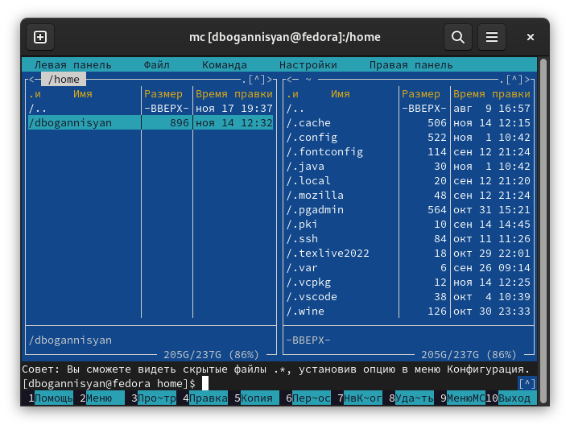{ #fig:001 width=70% }

## Переходим в каталог ~/work/arch-pc созданный при выполнении лабораторной работы No5 и с помощью функциональной клавиши F7 создайте папку lab06 

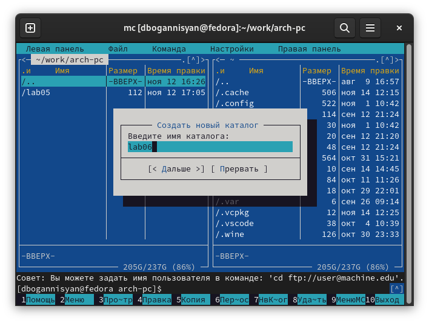{ #fig:002 width=70% }

## Пользуясь строкой ввода и командой touch создайем файл lab6-1.asm

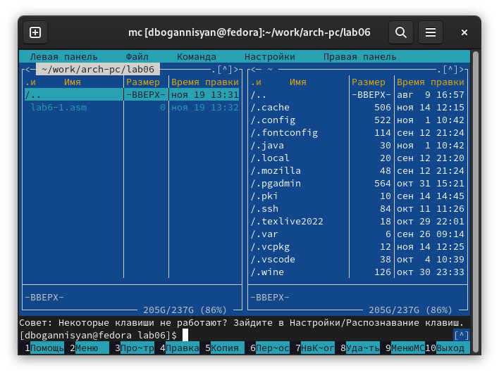{ #fig:003 width=70% }

## С помощью функциональной клавиши F4 открываем файл lab6-1.asm для редактирования во встроенном редакторе.

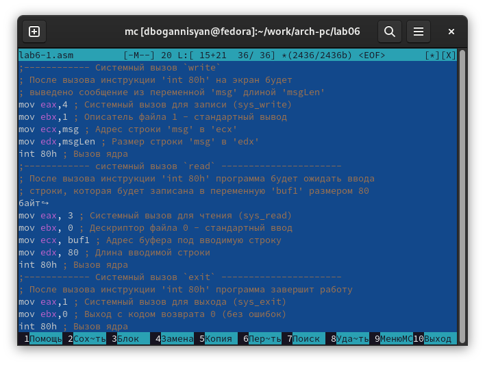{ #fig:004 width=70% }

## Вводим текст программы из листинга 6.1 (можно без комментариев), сохраняем изменения и закрывем файл.

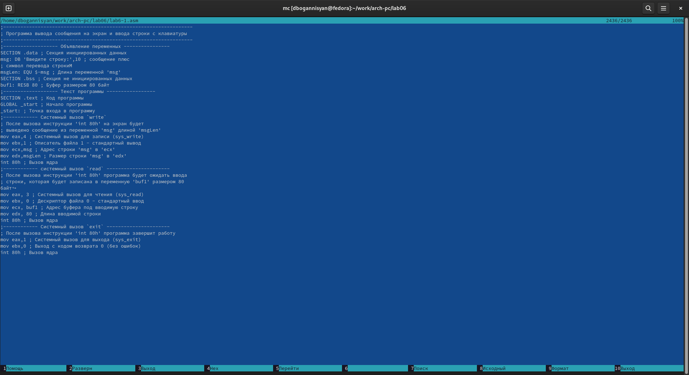{ #fig:005 width=70% }

## Оттранслируем текст программы lab6-1.asm в объектный файл. Выполниим компоновку объектного файла и запустим получившийся исполняемый файл. Программа выводит строку 'Введите строку:' и ожидает ввода с клавиатуры. На запрос вводим наши ФИО.

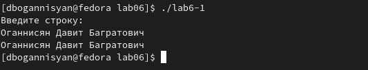{ #fig:006 width=70% }

## Cкачиваем файл in_out.asm со страницы курса в ТУИС и копируем в наш каталог.

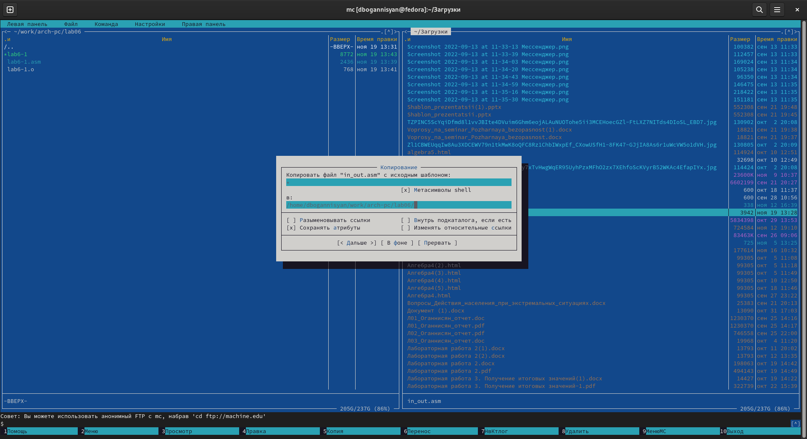{ #fig:007 width=70% }

## С помощью функциональной клавиши F6 создаем копию файла lab6-1.asm с именем lab6-2.asm. Выделяем файл lab6-1.asm, нажимаем клавишу F6 , вводим имя файла lab6-2.asm и нажимаем клавишу Enter

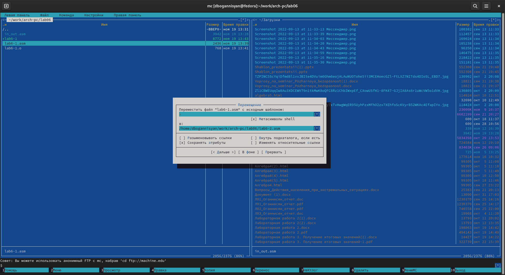{ #fig:008 width=70% }

## Исправим текст программы в файле lab6-2.asm с использованием подпрограмм из внешнего файла in_out.asm (используем подпрограммы sprintLF, sread и quit) в соответствии с листингом 6.2. Создаем исполняемый файл и проверяем его работу.

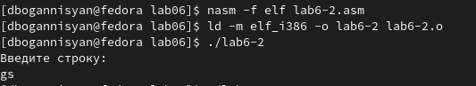{ #fig:009 width=70% }

## В файле lab6-2.asm заменим подпрограмму sprintLF на sprint. Создадим исполняемый файл и проверим его работу.

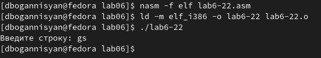{ #fig:012 width=70% }

Разница только в том, что в этом случае ввод осуществляется в одну строчку

## Задание для самостоятельной работы

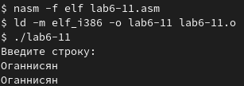{ #fig:010 width=70% }

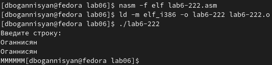{ #fig:011 width=70% }

# Выводы

Я приобрел практические навыкы работы в Midnight Commander и освоил
инструкции языка ассемблера mov и int.

